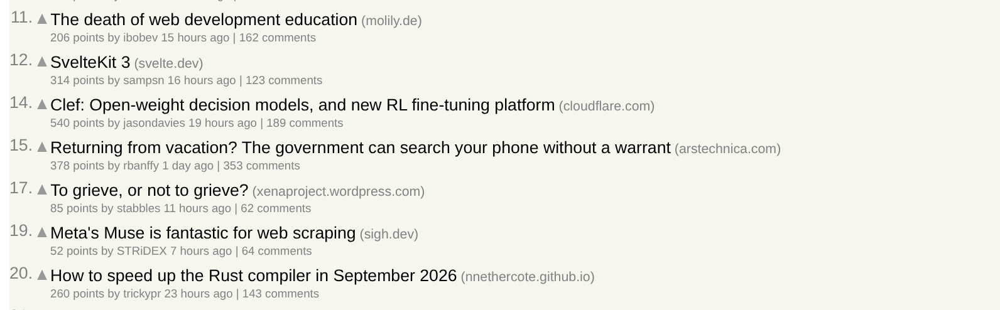
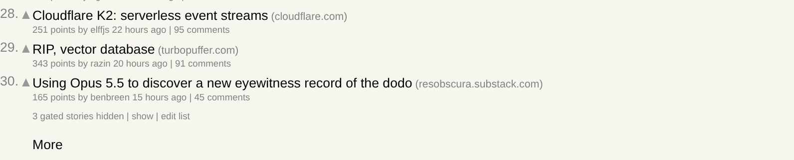
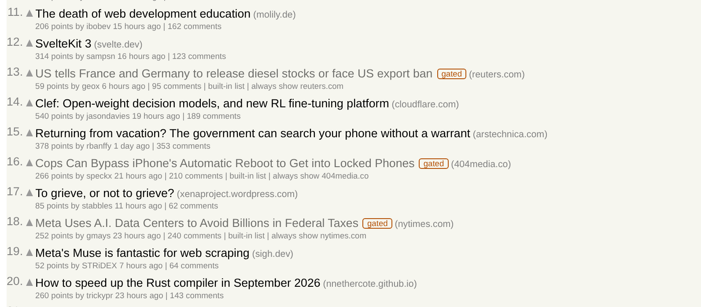
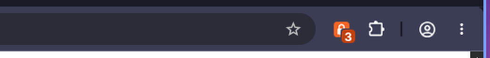
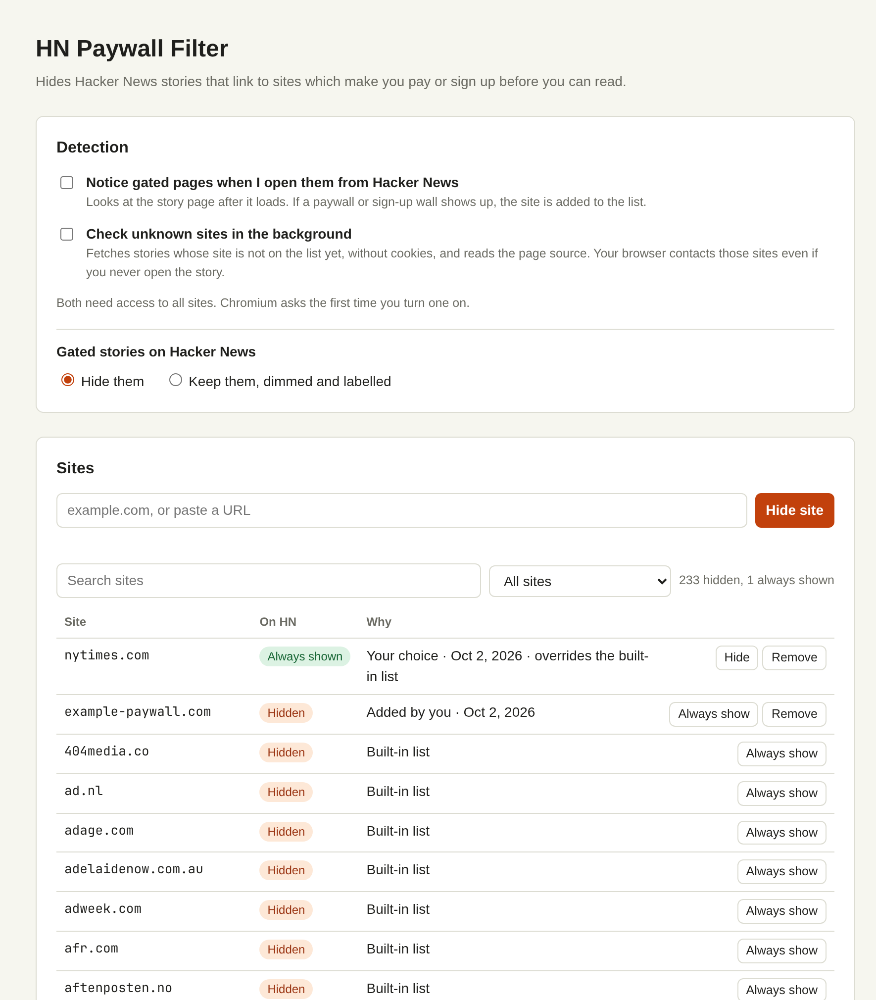

# HN Paywall Filter

A Chromium extension that hides Hacker News stories linking to sites which make you pay
or sign up before you can read.

## Screenshots

Gated stories are removed from the listing (note the gaps in the numbering), and a line
at the bottom says how many:

**show** brings them back in place, dimmed, with the reason and an undo button:

The pinned toolbar icon counts the gated stories on the current listing:

The options page holds the detection settings and the editable site list:

## Install

1. Open `chrome://extensions` and turn on **Developer mode**.
2. Click **Load unpacked** and pick this folder.

After editing the code, press the reload arrow on the extension's card.

## Use

- **On Hacker News** gated stories disappear from the lists Hacker News puts together
  for everyone: the front page, `newest`, `front`, `best`, `ask`, `show` and the like. A
  line at the bottom of the list says how
  many were hidden; **show** brings them back in place with the reason and an
  **always show** button. On every other page they stay where they are, dimmed and
  labelled **gated**: your `favorites`, `upvoted`, `submitted` and `hidden` stories, a
  list you asked for by name (`from?site=nytimes.com`), a story's own comments page.
  Nothing moves while you read either: a story a detector finds gated after the page
  loaded is labelled where it is, and hidden the next time the page loads. So is a site
  the detectors hide in that time, whose line at the top waits for the next load too.
  What you hide yourself goes at once. Hovering a visible story, or tabbing into it, reveals
  **mark gated**, which hides its site; on a touch screen it is always there. Where the
  story has no site of its own the button reads **hide this article** and hides that
  story alone: on a platform many authors share (`medium.com/@someone`, but
  not `someone.medium.com`), on a host that is no domain name (an IP address,
  `localhost`) and on one that is itself a shared name (`www.gov.uk`). Not where the
  site is set to always show, which would win. A button that could not do its work says
  why next to itself: once the extension was reloaded or updated, an HN page that was
  already open has to be reloaded before its buttons work again.
- **Toolbar button** on any page: hide that page's site or the one article, or stop
  hiding it. Its badge
  shows the number of gated stories on an HN listing; on other pages it shows **!** if
  the site is hidden on HN and **✓** if it is always shown. That mark needs access to all
  sites, so it is kept on every tab only while a detector is on.
- **Options page** (opens on install, or **edit list** on HN): search, add and remove
  sites, switch any site between hidden and always shown, and turn detection on.

A site is a registrable domain or a name below it. Where it starts is read off the
[public suffix list](https://publicsuffix.org/) in `src/psl.js`: a story on
`myapp.herokuapp.com` or `www.soumu.go.jp` belongs to that app or ministry, not to
`herokuapp.com` or `go.jp`. Such a shared name cannot be put on the list at all, nor can
an IP address or a bare machine name; a refused name is reported with the reason.

## How a story is judged

In this order:

1. **Your entries.** Sites you hid or set to always show. These win over everything, so
   set a site you subscribe to as always shown. They never expire: an entry of yours stays
   until you remove it. An entry covers the subdomains of its site, and the one nearest
   to the story decides, ahead of anything a detector found on a subdomain. An article
   you hid yourself stays hidden the same way, unless its site is set to always show.
2. **Sites the detectors hid**, unless you chose **show this article** for the story.
   That choice is yours too and does not expire: it stays until you remove it on the
   options page. It does not show an article on a site you hid yourself.
3. **Single articles.** What the detectors find applies to the article they looked at,
   not to its domain.
4. **Built-in list** in `src/seed.js`.

Two optional detectors add to the list. Both are off until you enable them on the options
page, and both need access to all sites: every `https` and `http` page, not local files
or other schemes. Chromium asks the first time you turn one on, and the extension gives
the access back when you turn the last one off, taking its marks off the article tabs.
(Chromium remembers that you agreed once, and usually does not ask again.) If you take
the access away yourself (on `chrome://extensions`), both detectors are switched off,
and stay off until you turn them on again.

- **On visit.** When you open a story from HN, the rendered page is checked for gate
  wording ("subscribe to continue reading") and sign-in overlays that block the page and
  cannot be dismissed. An offer shown by Piano, whose wording cannot be read, counts only
  when Piano says it has no close button: the same box carries donation appeals and
  newsletter offers over an article that is there in full. Wording in a paywall box or
  an overlay counts as it stands; anywhere else on the page it only counts when the
  article is withheld: the page is covered, cannot be scrolled, or has little text. A
  count of free articles left never counts on its own. A hit hides the article for 30
  days; a page that showed no wall counts as a free article on its site, unless it
  carried such wording, in which case nothing is recorded. Nor is anything recorded for a
  Piano offer that shows no close button without saying that it has none (which is most
  of those built from a template, walls included), or for one that can be closed over a
  page with little text. A wall that only appears once you scroll further replaces that
  record. Only the page you opened is judged: if the site moves on to another address
  without a reload, nothing is recorded either.
- **Background check.** Stories not yet judged are fetched without cookies and the page
  source is checked for a gate prompt, either on an article that is cut short or on a
  page that declares a paywall. Verdicts are cached per article: gated for 30 days, free
  for 14, failed for 3.
  Only the first 1.5 MB of a page are read, and judging them takes time in proportion to
  their length whatever the page holds: a fraction of a second at most. A page cut off
  at that limit is never judged gated for being short.
  Since anyone can submit a link and the request leaves from your own network, only
  `https` links to a public host name on the default port are fetched: never an IP
  address, `localhost`, a bare machine name or a name such as `.local`, `.lan` or
  `.internal`. Redirects are not followed: a link that only gains `www.` or a
  trailing slash is still judged when you open it, one that leads to another address
  is judged by neither detector. What the name cannot tell is where it resolves: a
  machine inside your network that holds a trusted certificate for a public name (an
  intranet host under a company domain, say) can still receive the request.

Both detectors read English. The gate wording they look for is English only, while much
of the built-in list is Dutch, German, French, Italian and Spanish: those sites are
hidden because they are on the list, and a wall in another language on a site that is
not goes unnoticed, short of a "payment required" answer or a Piano offer that says it
cannot be closed. Add such a site yourself.

One page says little about the rest of its site, and anyone can submit a link, so a
detector's verdict hides only that article. The whole site is hidden, for 30 days, once
three articles at different paths on it looked gated within two weeks and none looked free (or was
set to **show this article**) in that time. When that happens, a line at the top of the
HN listing names the site and offers **always show**. A fixed list of platforms that mix free and
paid posts or are shared by many authors (`MIXED` in `src/shared.js`: Medium, Substack,
dev.to, Reddit, X and others) and personal `/~user` pages are never hidden as a whole this
way, and neither is a host that is no domain name. To hide a whole platform all the same,
add it on the options page or with the toolbar button (which works for `medium.com`, not
for a platform that is a public suffix, such as `notion.site`). Removing a site the detectors hid
from the list also forgets the articles it rested on.

Paywall metadata alone is not treated as proof: metered sites set it on articles they
still show in full. Such a site is only hidden once it actually shows a wall, or when you
use **mark gated**. The background check also cannot see walls added by script.

## What is kept

Everything is kept in this browser profile (`chrome.storage.local`) and sent nowhere.
Besides your own entries and settings, that is what the detectors found:

- **On visit:** each story you opened from HN that was judged, gated or free, filed
  under the address of the article, with the time it was judged. This is a trace of what
  you read. Gated articles are listed on the options page; the free ones are not.
- **Background check:** the same for each story that was fetched, which tells which
  stories were on the listings you looked at, not which you opened.

These records go out of use (gated after 30 days, free after 14, failed checks after 3)
and are deleted the next time the browser starts after that, but
**clearing your browsing history does not remove them**. **Forget what was detected** on
the options page does: it removes all of them and the sites hidden on their strength,
and keeps your own entries. Removing the extension removes everything.

Nothing is recorded for what happens in an incognito window, should you allow the
extension there: a story opened in one is not looked at, and a listing read in one is
not checked in the background. Stories are still hidden there by what is already on the
list, and what you set by hand there (**mark gated**, the toolbar button) is stored like
anywhere else.

## Layout

| File | Purpose |
| --- | --- |
| `src/seed.js` | Built-in site list |
| `src/psl.js` | Public suffix list, rebuilt by `node tools/update-psl.mjs` |
| `src/shared.js` | Domain handling, classification, storage access |
| `src/signals.js` | Gate wording and metadata checks |
| `src/analyze.js` | Verdict from page source (background check) |
| `src/detect.js` | Verdict from the rendered page (on visit) |
| `src/background.js` | Service worker: all storage writes, both detectors |
| `src/hn.js`, `src/hn.css` | Hacker News page |
| `src/options.*`, `src/popup.*` | Site list editor and toolbar popup |

The service worker checks where each request comes from and what it carries. Your own
entries change only at the request of the options page, the popup or a Hacker News page,
and your settings only for the first two, which are also the only ones that can have the
detectors' records forgotten. The on-visit detector runs inside the story page,
so its report counts only while on-visit detection is on, for the story that tab is
showing, weighed as described above, and only as "gated" or "free" with a short reason.
This covers requests to the service worker; it does not yet keep a story page that
breaks into the detector from reaching the extension's storage itself.

## Tests

    npm test

Covers the list, classification, gate wording, page-source analysis, on-visit detection
(against a stand-in for the page), how the service worker records verdicts, which
requests it refuses, when it gives up access to all sites, what an update forgets of
what an older version recorded, what the Hacker News page offers a keyboard or a
screen reader, on which pages it hides stories, what it does with a verdict that arrives
while the page is open, and that a request which fails is reported where it was made. They also check that no script has a syntax error and that every file the
extension names is there.

No dependencies, so there is nothing to install: `npm test` runs `node --test`, on
Node 22 or later. A GitHub Actions workflow runs it on every pull request and on `main`.

## License

MIT. See `LICENSE`. The built-in site list started from the MIT-licensed list in
[hn-anti-paywall](https://github.com/MostlyEmre/hn-anti-paywall), itself taken from
Bypass Paywalls, which was MIT-licensed until 2020. `src/psl.js` holds the
[public suffix list](https://publicsuffix.org/), which is under the
[Mozilla Public License 2.0](https://mozilla.org/MPL/2.0/). `THIRD_PARTY_NOTICES` has the
notices of the two lists and says where the public suffix list's is.
